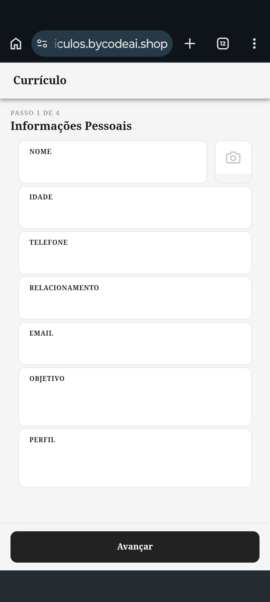
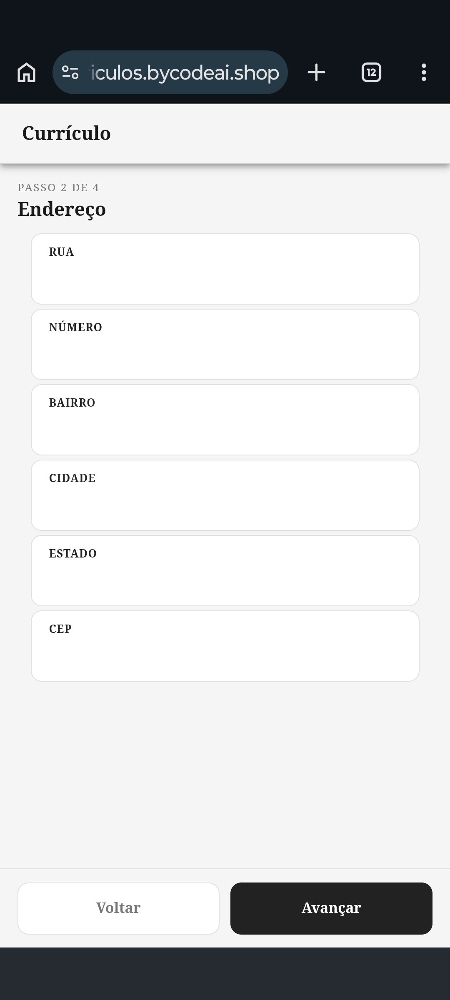
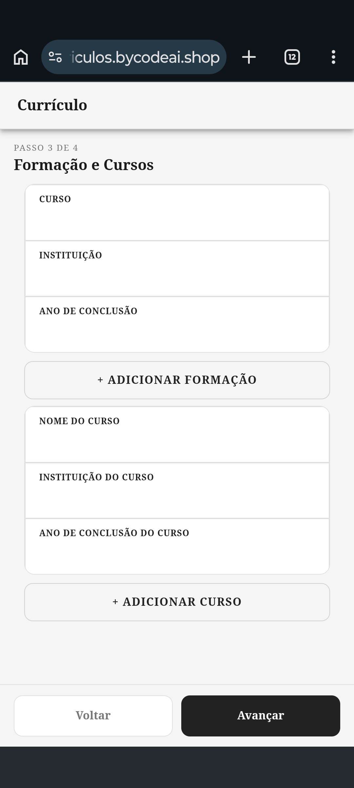
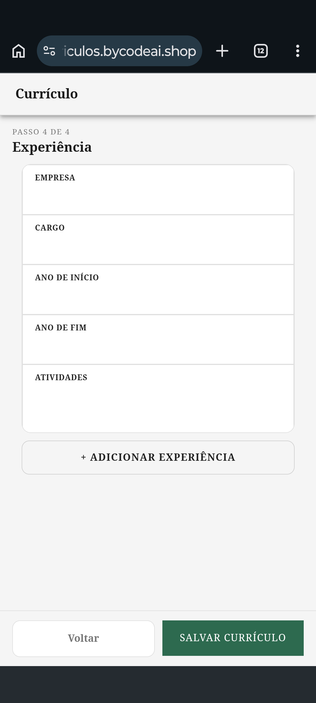

# Currículo

Aplicação fullstack para geração de currículos em PDF. O usuário preenche um formulário no app mobile (Ionic/Angular), os dados são enviados para a API .NET que salva no banco e retorna o PDF gerado com QuestPDF.

🔗 **Demo ao vivo:** [curriculos.bycodeai.shop](https://curriculos.bycodeai.shop/)

---

## Screenshots

| Passo 1 — Informações Pessoais | Passo 2 — Endereço |
|:---:|:---:|
|  |  |

| Passo 3 — Formação e Cursos | Passo 4 — Experiência |
|:---:|:---:|
|  |  |

---

## Stack

| Camada | Tecnologia |
|--------|-----------|
| Frontend | Ionic + Angular 20 + Capacitor |
| Backend | ASP.NET Core 8 + Entity Framework Core |
| Banco | SQL Server (schema `Curriculos`) |
| PDF | QuestPDF 2026 |
| Infra | Docker + Nginx + SSL |

---

## Estrutura do projeto

```
Curriculo/
├── frontend/               # App Ionic/Angular
│   └── src/app/
│       └── curriculo/      # Componente principal (form + lógica)
├── backend/                # API ASP.NET Core 8
│   ├── Controllers/        # CurriculoController
│   ├── Services/           # CurriculoService
│   ├── Models/             # Informacao, Endereco, Formacao, Curso, Experiencia
│   ├── Dto/                # DTOs de entrada/saída
│   ├── Data/               # AppDbContext + migrations
│   └── Utils/              # CurriculoLayout (geração do PDF)
├── infra/                  # Docker, Nginx, Dockerfile
├── cdn/ssl/                # Certificados SSL
└── sql/                    # Scripts auxiliares
```

---

## Modelo de dados

`Informacao` é a entidade raiz. Todos os relacionamentos partem dela.

```
Informacao (1) ──── (1) Endereco
Informacao (1) ──── (N) Formacao
Informacao (1) ──── (N) Curso
Informacao (1) ──── (N) Experiencia
```

Schema do banco: `Curriculos`

---

## API

**Base URL:** `/api/Curriculo`

| Método | Rota | Descrição |
|--------|------|-----------|
| `POST` | `/api/Curriculo` | Salva os dados e retorna o PDF |

O endpoint recebe um `CurriculoDto` no body, persiste todas as entidades e retorna um arquivo `application/pdf` com o nome `Curriculo_<Nome>.pdf`.

---

## Fluxo

```
[Ionic Form] → POST /api/Curriculo → CurriculoController
                                          ↓
                                   CurriculoService (salva no SQL)
                                          ↓
                                   CurriculoLayout (gera PDF com QuestPDF)
                                          ↓
                                   File(pdfBytes) → download no app
```

---

## Infra / Deploy

O projeto roda em container único com dois processos internos:

- `serve` na porta `8100` → serve o build do Angular/Ionic
- `dotnet backend.dll` na porta `8087` → API .NET

O Nginx faz proxy reverso com SSL e roteia:

- `/` → frontend (`:8100`)
- `/api/` → backend (`:8087`)

**Portas expostas pelo compose:**

| Porta host | Destino |
|-----------|---------|
| 8100 | Frontend |
| 8086 | Backend (mapeado para 8087 interno) |
| 8088 | Nginx HTTP |
| 2053 | Nginx HTTPS |

**Rede Docker:** `projetosdb-network` (externa, compartilhada com outros projetos)

---

## Desenvolvimento local

### Frontend

```bash
cd frontend
npm install
ionic serve
```

### Backend

```bash
cd backend
dotnet restore
dotnet run
```

> A string de conexão fica em `appsettings.json` → `ConnectionStrings:DefaultConnection`

As migrations são aplicadas automaticamente na inicialização (`db.Database.Migrate()`).

### Build e deploy

```bash
cd infra
docker compose up -d --build
```

---

## Dependências principais

**Backend (NuGet)**
- `Microsoft.EntityFrameworkCore.SqlServer` 8.0.12
- `QuestPDF` 2026.5.0
- `SkiaSharp.NativeAssets.Linux.NoDependencies` 3.119.4

**Frontend (npm)**
- `@ionic/angular` ^8.0.0
- `@angular/core` ^20.0.0
- `@capacitor/android` ^8.4.0
- `@capacitor/camera` ^8.2.0
- `@capacitor/filesystem` ^8.1.2
- `@capacitor-community/file-opener` ^8.0.1
